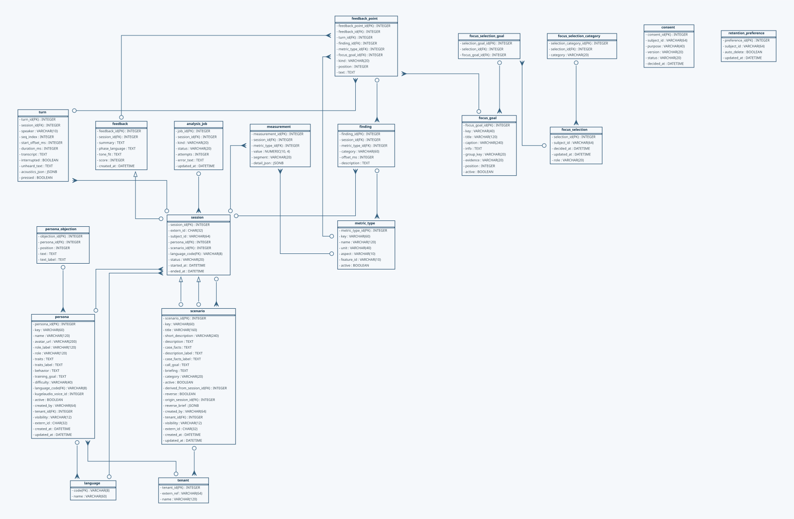

# Datenmodell

Das folgende ER-Diagramm zeigt das Persistenzschema der Anwendung: die Tabellen,
ihre Spalten samt Datentypen und die Fremdschlüsselbeziehungen zwischen ihnen.

Es ist **nicht von Hand gezeichnet**. `backend/db/models.py` ist die einzige
Quelle der Wahrheit; sowohl die Alembic-Migrationen als auch dieses Diagramm
werden daraus abgeleitet. Das Diagramm wird bei jedem Doku-Build neu aus den
Modellen erzeugt und kann deshalb nicht vom tatsächlichen Schema abweichen.



Wer das Diagramm außerhalb eines Doku-Builds braucht, ruft den Generator direkt
auf:

```bash
python scripts/generate_erd.py
```

Der Aufruf schreibt `docs/er_modell.png` und `docs/er_modell.svg` und benötigt
das Graphviz-Programm `dot` (`brew install graphviz`). Steht `dot` nicht zur
Verfügung, baut die Doku trotzdem — sie zeigt dann das zuletzt eingecheckte
Diagramm, und im Build-Log steht eine entsprechende Warnung.
